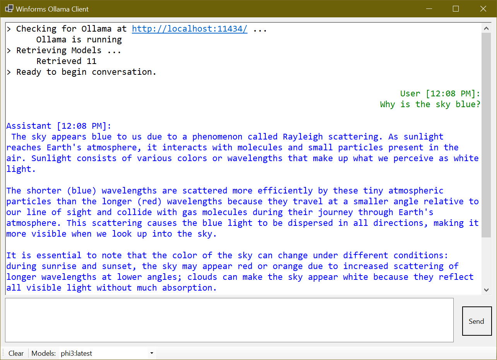

# Winforms Ollama Chat Client

## Description

Winforms Ollama Client is a simple example of a Visual Basic.NET (winforms) client to interact with a locally hosted Ollama AI server.
Discover ollama here: https://ollama.com/



## Features

- Connect to a local Ollama instance
- Retrieve and select from available AI models
- Real-time conversation with AI models
- Streaming responses
- Clear conversation history
- User-friendly interface with color-coded messages

## Prerequisites

- Windows operating system
- .NET Framework 7 or later
- Ollama installed and running locally (default: http://localhost:11434/)
- At least one model downloaded

## Installation

1. Clone the repository.
2. Open the solution in Visual Studio.
3. Build the solution to restore NuGet packages.
4. Run the application.

## Usage

1. Launch the application.
2. The client will automatically attempt to connect to Ollama at http://localhost:11434/.
3. If successful, it will retrieve available models.
4. (optional) Select a model from the dropdown list.
5. Type your message in the input box and press Enter or click the Send button.
6. The AI's response will appear in the conversation window.

## Dependencies

- Newtonsoft.Json: Used for JSON serialization and deserialization. https://www.nuget.org/packages/Newtonsoft.Json/
-- This should ideally automatically download when you compile the project, but if it doesn't, use the package manager to install it.
- System.Net.Http: Used for making HTTP requests to the Ollama API.

## Notes

- You may have to (or be prompted to) allow this application on Windows Firewall, to allow it to connect to http://localhost:11434/
- There are many features that I could add (conversation saving etc) but this is intended as a bare bones example

## License

This project is licensed under the MIT License - see the [LICENSE.md](LICENSE.md) file for details.

## Acknowledgments

- [Ollama](https://github.com/ollama/ollama/) for providing the backend AI model runner.

## Disclaimer

This is an unofficial client for Ollama and is not affiliated with or endorsed by the Ollama project or its creators.
```